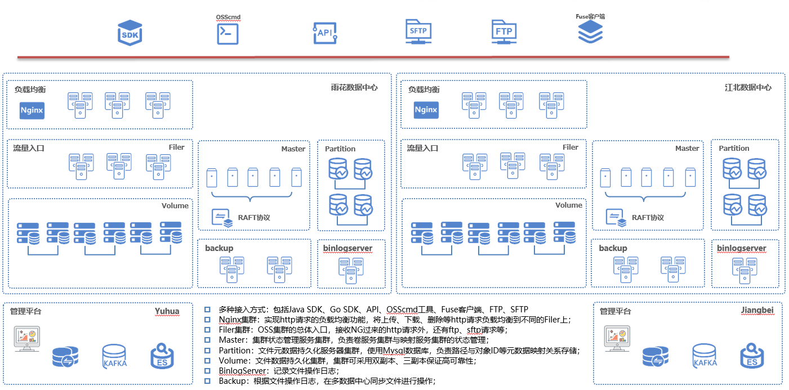

# 1 项目介绍
## 1.1简介
CangHaiOS是分布式对象存储产品，可部署在X86通用服务器上，采用分布式架构，提供企业级高可用和线性扩展能力，广泛适用于金融、运营商、政府公共事业等行业云存储场景。

## 1.2 整体架构

### 1.2.1主要模块说明
* Filer：OSS集群的请求入口，除接收http请求外，还有ftp、sftp请求。
* Master：集群状态管理服务集群，负责卷服务集群与映射服务集群的状态管理。
* Partition：文件元数据持久化服务器集群，使用Mysql数据库，负责路径与对象ID等元数据映射关系存储。
* Volume：文件数据持久化集群，集群可采用双副本、三副本保证高可靠性。
* BinlogServer：记录文件操作日志。
* Backup：根据文件操作日志，在多数据中心同步文件进行操作。
* Fuse：在Linux系统中，将对象存储的存储空间(Bucket)挂载到本地文件系统中，能够像操作本地文件一样操作文件，实现数据共享。

## 1.3 产品亮点
### 1.3.1 高可用性、可靠性、扩展性
* 每个文件的不同冗余存储在同一个区域内多个设备上，确保数据持久性和可用性。
* 存储空间大小无限制，可以根据所需存储量无限扩展存储空间，解决了传统硬件存储扩容问题。
* 当检测到数据有部分损坏或丢失时，OSS会利用冗余数据重建并修复损坏数据。

### 1.3.2 方便快捷的使用方式
* 提供标准的RESTful API接口、丰富的SDK包、客户端工具、控制台。可以像使用文件一样方便地上传、下载、检索、管理海量数据。
* 兼容Amazon S3接口，可轻松实现亚马逊、阿里云等公有云数据与CangHaiOS之间的数据迁移。
* 提供标准HDFS接口，大数据应用场景中可直接将数据存在对象存储上。
* 支持文件生命周期管理。可以通过设置生命周期规则，将到期数据批量删除或者转储为更低成本的低频访问存储或归档存储。

### 1.3.3 强大、灵活的安全机制
提供企业级多层次安全防护，包括防盗链、服务端加密、客户端加密、合规保留策略、版本控制等。

### 1.3.4 QoS控制
* 可针对单个租户进行tps控制、流量控制、图片请求处理等控制。

### 1.3.5 提供丰富、强大的增值业务
* 图片处理：支持JPG、PNG、BMP、WebP等多种图片格式的转换，以及缩略图、剪裁、水印、缩放等多种操作。
* 内容加速分发：OSS作为源站，搭配CDN进行内容分发，提升同一个文件被重复下载的体验。

## 1.4 产品功能特性
* 上传文件：创建存储空间后，可以上传任意文件到该存储空间
* 下载文件：当文件上传至存储空间后，可以将文件下载到本地
* 搜索文件：可以在存储空间中快速查找目标文件
* 删除文件：支持删除文件或者文件夹
* 数据迁移：支持
* 数据冗余保护：数据支持1~3副本存储，存储持久性可达99.99995%，支持纠删码。
* 数据加密：支持客户端和服务器端加密，可以选择合适的加密方式将数据加密后存储。
* 图片处理：对存储的jpg、png图片执行不同的图片处理操作，如格式转换、裁剪、缩放、旋转、水印等。
* 多种接入方式：http、ftp、sftp

## 1.5产品规格
* 系统架构：分布式架构
* 存储介质：HDD
* 网络类型：以太网
* 数据冗余保护：1~3副本
* 单集群内支持的节点数：1024
* 单集群支持最大用户个数：100000
* 单集群支持最大存储空间个数：1000000
* 系统支持最大对象个数：万亿
* 单用户支持最大存储桶数：100
* 单桶支持最大对象数：100亿
* 单个文件大小：6T
* 可用性：99.99%

# 2 构建fuse版本
	操作系统：CentOS7.3  
	# sh make-CangHaiOs.sh

# 3 fuse启动
	操作系统：CentOS7.3  
	/opt/ossfuse -v=0 -http=true -log_dir=/opt/log/ossfuse/ ossfuse -account=test -bucket=test -mountpoint=/mnt/ossfuse -ossendpoint=oss.testdomain.com -ip=10.1.1.1

# 4 License

Copyright 2021 Suning Inc

   Licensed under the Apache License, Version 2.0 (the "License");
   you may not use this file except in compliance with the License.
   You may obtain a copy of the License at

       http://www.apache.org/licenses/LICENSE-2.0

   Unless required by applicable law or agreed to in writing, software
   distributed under the License is distributed on an "AS IS" BASIS,
   WITHOUT WARRANTIES OR CONDITIONS OF ANY KIND, either express or implied.
   See the License for the specific language governing permissions and
   limitations under the License.
